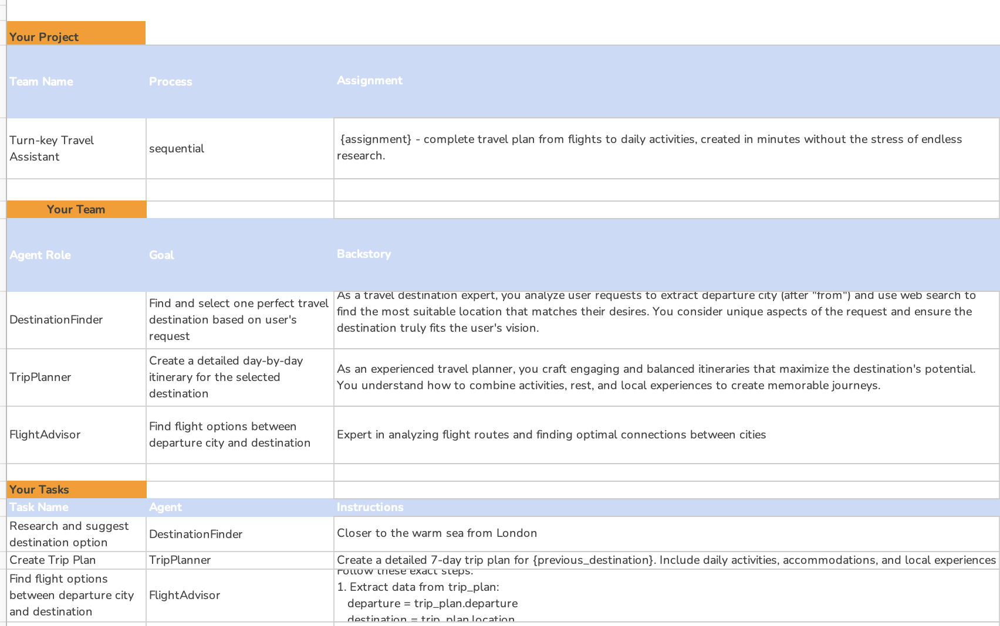
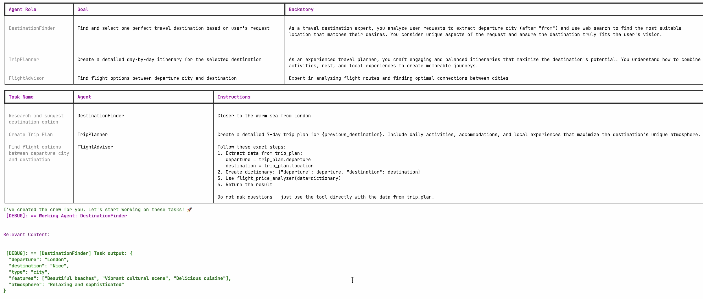
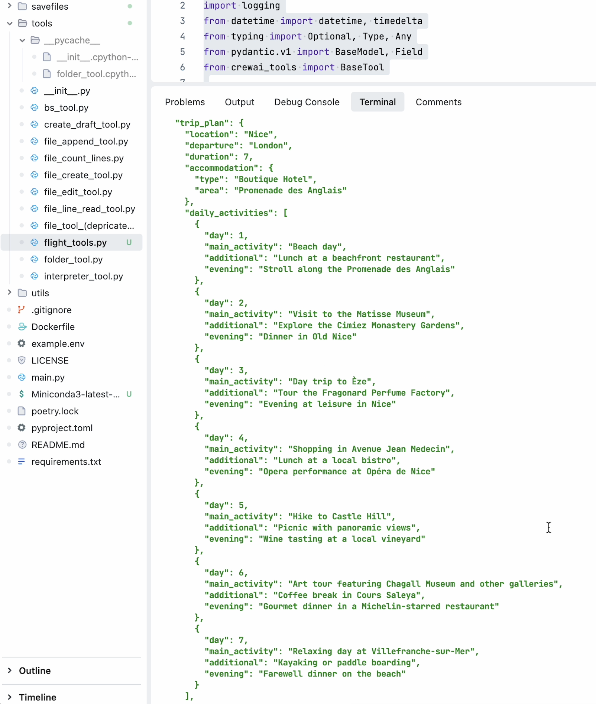
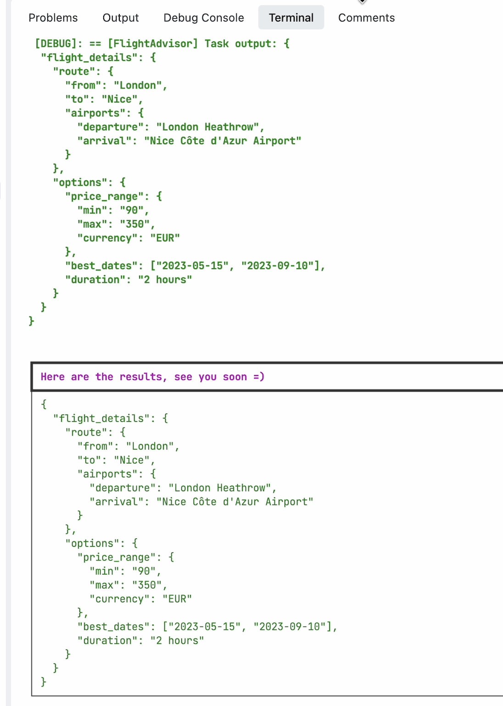

# Turn-key Travel Assistant 🌍✈️

## Project Overview

Turn-key Travel Assistant is an innovative travel planning solution that revolutionizes the way people explore the world. By leveraging an intelligent assembly of AI agents, this project simplifies the complex process of travel planning, transforming it from a time-consuming task into a seamless, personalized experience.

## Key Features

### Intelligent Travel Planning
- **Destination Finder**: Leverages web search to identify the perfect travel destination based on user preferences
- **Trip Planner**: Generates comprehensive 7-day itineraries with detailed daily activities
- **Flight Advisor**: Analyzes and suggests optimal flight options with price range insights

## Problem Solved

Travel planning often involves:
- Extensive research
- Balancing spontaneity with budget constraints
- Coordinating complex schedules

Turn-key Travel Assistant eliminates these pain points by creating a complete, randomized travel itinerary tailored to individual preferences.

## Project Structure and Workflow

*Project structure showing the team organization, agent roles, and task assignments*

## Agent Roles and Tasks

*Detailed view of agent roles, goals, and backstories that power the travel planning process*

## Implementation Results

### Trip Planning Output

*Example of a generated 7-day trip plan for Nice, France, including accommodations and daily activities*

### Flight Advisor Output

*Flight details showing route information, price ranges, and optimal travel dates*

## Technical Architecture

The project is implemented using the CrewAI platform, featuring three primary agents:

1. **DestinationFinder**
   - Utilizes `website_search_tool`
   - Analyzes user requests to select ideal travel locations
   - Considers unique aspects of user preferences

2. **TripPlanner**
   - Uses `scrape_website_tool`
   - Creates detailed day-by-day itineraries
   - Maximizes destination experience

3. **FlightAdvisor**
   - Employs custom `flight_price_analyzer`
   - Identifies nearby airports
   - Determines flight price ranges

## Demo

Check out the project in action! 

## Core Technologies

- CrewAI
- Web Search Tools
- Custom Flight Price Analyzer
- Python

